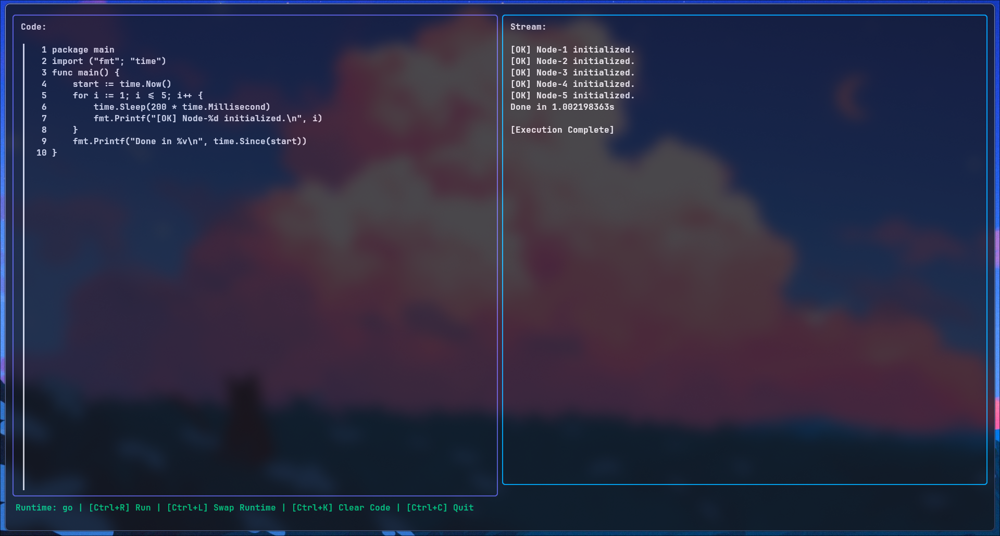
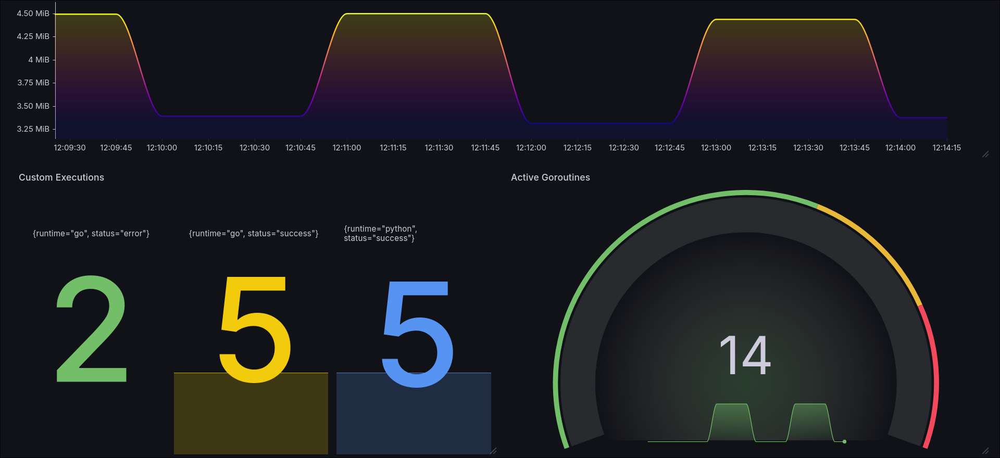
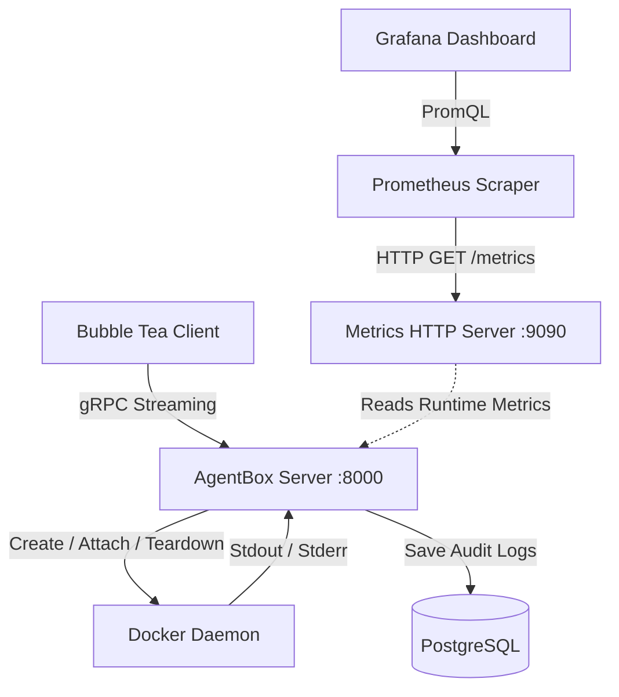

# 📦 AgentBox

## Distributed Secure Code Execution Platform

<div align="center">


</div>

AgentBox is a distributed remote code execution platform written in **Go**. It securely orchestrates ephemeral Docker containers to execute untrusted workloads, streams standard output back to clients in real time, and maintains a persistent audit trail.

The platform is built around **gRPC server-side streaming** and the **Docker Engine SDK**, providing a highly concurrent infrastructure layer with per-execution resource isolation and in-memory code injection.

---

## 🖼️ Platform Interfaces

AgentBox provides an asynchronous, non-blocking terminal user interface (TUI) for executing code, alongside a decoupled observability stack for platform monitoring.

| Terminal Client (Bubble Tea) | Operational Telemetry (Grafana) |
|:---:|:---:|
|  |  |
| *Real-time workload execution & streaming* | *Live system health and execution metrics* |

---

## ✨ Features

- **Zero-Disk I/O Code Injection** — Source code is dynamically packaged into in-memory tar archives and injected directly into containers through the Docker SDK.
- **Real-Time Log Streaming** — Streams container `stdout`/`stderr` to clients over gRPC without waiting for execution to complete.
- **Resource Isolation** — Applies per-execution CPU and memory limits to constrain untrusted workloads.
- **Decoupled Observability** — Separates execution APIs from the Prometheus metrics endpoint through dedicated gRPC and HTTP servers.
- **Persistent Audit Trail** — Stores execution history, exit codes, and execution durations in PostgreSQL using connection pooling.
- **Ephemeral Execution** — Creates isolated containers for individual workloads and removes them after execution.
- **Context-Aware Cleanup** — Propagates request cancellation through the execution stack to prevent orphaned containers.
- **Automated CI/CD** — GitHub Actions validates formatting, static analysis, tests, and builds on every change.

---

## 🚦 Execution Lifecycle

```text
Client
   │
   ▼ (gRPC ExecuteRequest)
┌────────────────────┐
│ gRPC API Server    |
└────────────────────┘
          │
          ▼
┌────────────────────┐
│ Runtime Strategy   │ (Selects Go/Python)
└────────────────────┘
          │
          ▼
┌────────────────────┐
│ Docker Orchestrator│
└────────────────────┘
          │ 1. Create cgroup limits
          │ 2. Inject in-memory tarball
          ▼
    [ Ephemeral Container ]
          │
          ▼ 3. Multiplex Output (io.MultiWriter)
     ┌────┴────┐
     │         │
 Live Stream   Buffer
 (to Client)   (to DB)
     │         │
     ▼         ▼
  Done!    Save Audit Record
```

---

## 🏛️ Architecture

AgentBox is divided into an ephemeral client and a persistent server.

The server is responsible for:

- gRPC request handling
- Runtime selection
- Docker container lifecycle management
- Resource limit configuration
- Real-time output streaming
- PostgreSQL persistence
- Prometheus metrics
- Request cancellation and cleanup

The client remains lightweight and communicates with the server exclusively through the gRPC API.

### High-Level Architecture



---

## 🚀 Engineering & Design Decisions

### 1. Zero-Disk-I/O Code Injection

Writing submitted source code to the host filesystem introduces unnecessary disk I/O and creates additional filesystem management concerns.

AgentBox instead constructs source archives entirely in memory using Go's `archive/tar` and `bytes.Buffer`.

The resulting tar stream is passed directly to the Docker Engine through the Docker SDK.

```text
Source Code
     │
     ▼
┌───────────────┐
│ bytes.Buffer  │
└───────┬───────┘
        │
        ▼
┌───────────────┐
│  tar.Writer   │
└───────┬───────┘
        │
        ▼
 In-memory TAR
        │
        ▼
 Docker Engine
        │
        ▼
Container Filesystem
```

This avoids creating temporary source files on the host.

---

### 2. Real-Time Stream Multiplexing

AgentBox needs to satisfy two requirements simultaneously:

1. Stream execution output to the client immediately.
2. Preserve the complete output for the execution record.

The execution output can therefore be duplicated into multiple destinations:

```text
                    Container
                        │
                        │ stdout / stderr
                        ▼
                 ┌─────────────┐
                 │ Output      │
                 │ Stream      │
                 └──────┬──────┘
                        │
                        ▼
                  io.MultiWriter
                    │       │
             ┌──────┘       └──────┐
             ▼                     ▼
        gRPC Stream           Memory Buffer
             │                     │
             ▼                     ▼
           Client              PostgreSQL
```

This allows the client to receive output without waiting for the workload to finish while the server simultaneously retains the execution output.

---

### 3. Decoupled Observability

AgentBox separates execution traffic from metrics collection.

The primary server exposes the gRPC API while a dedicated HTTP endpoint exposes Prometheus metrics:

```text
                 AgentBox
                    │
        ┌───────────┴───────────┐
        │                       │
        ▼                       ▼
   gRPC :8000              HTTP :9090
        │                       │
        ▼                       ▼
   Client Requests          /metrics
                                │
                                ▼
                           Prometheus
                                │
                                │ PromQL
                                ▼
                             Grafana
```

This keeps operational telemetry independent from the transactional execution API.

Prometheus can scrape execution counters and Go runtime metrics without querying the primary PostgreSQL audit database.

---

### 4. Context-Driven Resource Cleanup

Each execution is associated with a `context.Context`.

Cancellation propagates through the execution stack:

```text
Client Disconnect
       │
       ▼
context.Cancel()
       │
       ▼
gRPC Handler
       │
       ▼
Execution Service
       │
       ▼
Docker Orchestrator
       │
       ▼
Container Cleanup
```

This allows the server to terminate and remove an execution container when the request is cancelled, reducing the risk of orphaned workloads consuming system resources.

---

## ⚙️ Technology Stack

| Layer | Technology |
|---|---|
| Language | Go |
| RPC | gRPC |
| Interface Definition | Protocol Buffers |
| Containerization | Docker |
| Container API | Docker Engine SDK |
| Resource Isolation | Linux cgroups |
| Database | PostgreSQL |
| PostgreSQL Driver | pgx / pgxpool |
| Telemetry | Prometheus |
| Visualization | Grafana |
| Client UI | Bubble Tea / Lip Gloss |
| CI/CD | GitHub Actions |

---

## 🚀 Getting Started

### Prerequisites

Make sure the following are installed:

- Go 1.25+
- Docker Engine
- Docker Compose

### 1. Clone the Repository

```bash
git clone https://github.com/AnandRaj2224/agentbox
cd agentbox
```

### 2. Start the Infrastructure

Start PostgreSQL, Prometheus, and Grafana:

```bash
docker compose up -d
```

Verify the containers are running:

```bash
docker compose ps
```

### 3. Start the AgentBox Server

Run the gRPC server:

```bash
go run ./cmd/agentbox-server/main.go
```

The server connects to the Docker daemon and PostgreSQL instance.

### 4. Start the Client

Open another terminal and launch the interactive terminal client:

```bash
go run ./cmd/agentbox-client/main.go
```

You can now submit workloads through the AgentBox TUI.

---

## 🔄 CI/CD

AgentBox uses GitHub Actions to automatically validate changes.

The CI pipeline performs:

```text
Push / Pull Request
        │
        ▼
  Checkout Repository
        │
        ▼
      Setup Go
        │
        ▼
     go fmt
        │
        ▼
     go vet
        │
        ▼
   go test ./...
        │
        ▼
      go build
        │
        ▼
      ✓ Pass
```

This ensures that formatting, static analysis, tests, and compilation are validated before changes are merged.

---

## 📊 Observability

AgentBox exposes Prometheus metrics through a dedicated HTTP endpoint.

Example categories include:

- Total executions
- Successful executions
- Failed executions
- Execution duration
- Active workloads
- Go runtime metrics

Prometheus collects these metrics and Grafana provides the operational dashboard.

Example monitoring flow:

```text
AgentBox
   │
   │ GET /metrics
   ▼
Prometheus
   │
   │ PromQL
   ▼
Grafana
```

---

## 🔐 Security Considerations

AgentBox is designed around the assumption that submitted workloads are **untrusted**.

Each execution is isolated inside an ephemeral Docker container with configurable resource constraints.

The execution layer therefore separates:

```text
Untrusted Workload
       │
       ▼
Ephemeral Container
       │
       ├── CPU Limit
       ├── Memory Limit
       └── Lifecycle Cleanup
```

> **Important:** Container isolation should not be treated as a complete security boundary for arbitrary hostile workloads. Production deployments should apply additional hardening such as restricted container capabilities, filesystem restrictions, network isolation, seccomp/AppArmor policies, and appropriate daemon isolation.

---

## 👨‍💻 Author

**Anand Raj**

Backend • Go • Distributed Systems • Infrastructure